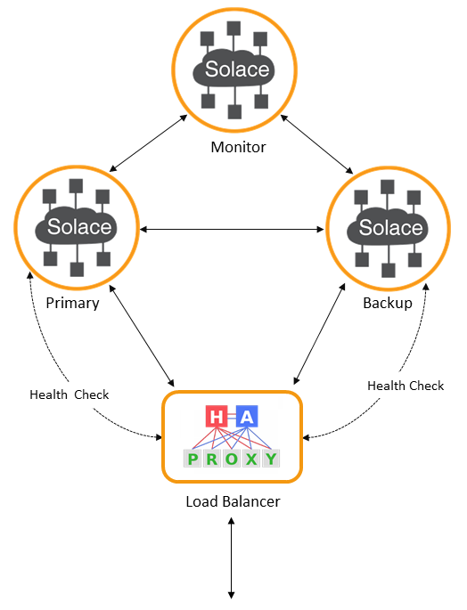

Configure High-availability Groups Using Docker Compose
=====
This project provides instructions and tools to use Docker Compose to configure a High-availability (HA) redundancy group of Solace PubSub+ software message broker Docker containers on a desktop. 
<br><br>

## Contents

* [Before you being](#before-you-being)
  * [Assumptions](#prerequisites)
  * [Docker Compose](#docker-compose)
* [Step 1: Get a Software Message Broker](#get-message-broker) 
* [Step 2: Download Docker Compose Template](#download-template) 
* [Step 3: Run Docker Compose](#run-docker-compose) 
* [Step 4: Manage the Container](#manage-container) 
* [Next Steps](#next-steps) 
<br><br>
<a name="before-you-being"></a>
## Before you begin
In the sample configuration below, we will use the Docker Compose template that is provided in this project, to set up an HA group. This sample configuration, which uses [Solace PubSub+ Standard](https://docs.solace.com/Solace-SW-Broker-Set-Up/Setting-Up-SW-Brokers.htm#Compare), is suitable for demonstrating and testing PubSub+ fundamentals, such as HA failover and guaranteed messaging, in non-production situations. The intent of the configuration is to help you become familiar with the ins-and-outs of HA set up as a step towards using more advanced, production-oriented configurations. 

<a name="prerequisites"></a>
### Assumptions

* If you are using macOS:
  * Mac OS X Yosemite 10.10.3 or higher.
* If you are using Windows:
  * Windows Pro 10.
  * Windows PowerShell.
* Docker installed, with at least 6 GiB of memory (4 GiB must be RAM) and 2 virtual cores dedicated to Docker. For this example, 4 GiB of RAM, 2 GiB of swap space, and 2 virtual cores have been dedicated to Docker. To learn about allocating memory and swap space, refer to the Docker Settings page for [Docker for Mac](https://docs.docker.com/docker-for-mac/#advanced) or [Docker for Windows](https://docs.docker.com/docker-for-windows/#advanced).
* A host machine with 8 GB RAM and 4 CPU cores with hyper-threading enabled (8 virtual cores) is recommended.
* All software message broker Docker container images in the HA group must be the same: Solace PubSub+ 8.10 or higher.

<a name="docker-compose"></a>
### Docker Compose
The Docker Compose template allows you to get an HA group up-and-running using a single command. Once the command is executed, the template automatically creates all the necessary containers and configures the HA group. It also creates a HAProxy load balancer, HAProxy. The load balancer monitors the health of the primary and standby message brokers, and based on the results of the health check, directs traffic to the active message broker. The diagram below illustrates the HA group setup fronted by a load balancer.



The template contains the following two files:
* _PubSub_standard_HA.yml_ — The docker-compose script that creates the containers for the primary, backup, and monitoring nodes as well as a container for the load balancer. The script also contains configuration keys for setting up redundancy, which automatically get the HA group up-and-running.
* _assertMaster.perl_ — A Perl script that creates the HAProxy load balancer configuration file, which is mapped to the load balancer container. Once the containers are created, the load balancer automatically executes the _Assert master admin operation_, which ensures that the configuration of the primary and backup message brokers are synchronized. For more information, refer to [Solace PubSub+ documentation - Asserting Message Broker System Configurations](https://docs.solace.com/Configuring-and-Managing-Routers/Using-Config-Sync.htm#Assertin).
<br><br>
<a name="get-message-broker"></a>
## Step 1: Get a Software Message Broker 

First, you need to obtain a message broker Docker package, which is a compressed tar archive containing a message broker Docker repository consisting of a single  message broker Docker image. 

**Solace PubSub+ Standard**: Go to [dev.solace.com/downloads](http://dev.solace.com/downloads/#vmr). Then select the docker link from Solace PubSub+ Standard. You will be able to download a compressed archive file called `solace-pubsub-standard-<version>-docker.tar.gz`.

**Solace PubSub+ Enterprise Evaluation Edition**: Go to [dev.solace.com/downloads](http://dev.solace.com/downloads/#vmr). Then select the docker link from Solace PubSub+ Enterprise Evaluation Edition. You will be able to download a compressed archive file called `solace-pubsub-evaluation-<version>-docker.tar.gz`.

**Solace PubSub+ Enterprise**: If you have purchased a Docker image of Solace PubSub+ Enterprise, Solace will give you information for how to download the compressed tar archive package from a secure Solace server. Contact [Solace Support](https://solace.com/support) if you require assistance.

Once you have obtained Docker package, you can upload it to a directory on your host and load the image using these steps:
1. Start Docker and open a terminal (PowerShell for Windows). 
2. Load the image:
```
> docker load -i Users/username/Downloads/solace-pubsub-standard-8.10.x.x-docker.tar
```

In this example,  the compressed tar archive of Solace PubSub+ Standard has been uploaded to `Users/username/Downloads` directory. When loading is finished, you can check the image with the `docker images` command.
<br><br>
<a name="download-template"></a>
## Step 2: Download Docker Compose Template

Clone the repository and cd into the template folder. 
```
> git clone https://github.com/SolaceDev/ha-quickstart-docker-compose
> cd ha-quickstart-docker-compose/template
```
You can also download the Zip file through the Clone or download tab.
<br><br>
<a name="run-docker-compose"></a>
## Step 3: Run Docker Compose

Before running the docker-compose command, it's recommended that you execute `docker volume prune` to remove unused local volumes. This is recommended if you are setting up an HA group in a resource-limited environment such as a laptop with limited disk space.

Run the following command to get the HA group up-and-running.

**MacOS**

```
> export:TAG="<docker-image-tag>"; docker-compose -f PubSub_Standard_HA.yml up
```
**Windows**
```
> $env:TAG="<docker-image-tag>"; docker-compose -f PubSub_Standard_HA.yml up
```

Where: `<docker-image-tag>` is the TAG number of the software message broker Docker image. You can check the TAG number using the `docker images` command.

Once the primary, backup, monitoring, and lb (load balancer) containers are created, it will take about 60 seconds for the message brokers to come up and the _Assert master admin operation_ to complete. You will notice the following behaviour on the terminal:
```
...
primary     |
lb          |  checking if message broker 127.0.0.1:8080 is ready, attempt # 5
lb          |  checking if message broker 127.0.0.1:8080 is ready, attempt # 6
lb          |  checking if message broker 127.0.0.1:8080 is ready, attempt # 7
lb          |  checking if message broker 127.0.0.1:8080 is ready, attempt # 8
lb          |  checking if message broker 127.0.0.1:8080 is ready, attempt # 9
lb          |  checking if message broker 127.0.0.1:8080 is ready, attempt # 10
lb          |  Assert master admin operation completed, attempt # 10

```

The HA group will be up-and-running once the _Assert master admin operation_ is completed. You can check the status of the containers by executing the `docker ps` command. The status of all the four containers, primary, backup, monitoring, and lb, must be Up.
<br><br>
<a name="manage-container"></a>
## Step 4: Manage the Container
You can access the Solace management tool, WebUI, or the Solace CLI to start issuing configuration or monitoring commands on the message broker.

Solace WebUI management access:

1. Open a browser and enter this url: http://127.0.0.1:8080
2. Log in as user _admin_ with password _admin_.

Solace CLI management access:

1. Enter the following docker exec command to access the Solace CLI on the primary message broker:

```
> docker exec -it primary cli
```
2. Enter the following commands to enter configuration mode:
```
primary> enable
primary# config
primary(configure)#
```
3. Issue configuration or monitoring commands. For a list of commands currently supported on the message broker, refer to [Solace PubSub+ documentation - Solace CLI](https://docs.solace.com/Solace-CLI/Using-Solace-CLI.htm).
<br><br>
<a name="next-steps"></a>
## Next Steps
At this point you have an HA redundancy group running on your platform and Guaranteed Messaging is enabled. You can now do things like use the SDKPerf tool to test messaging, perform administrative task using WebUI, or test the HA group’s failover operation.

* [Download SDKPerf](http://dev.solace.com/downloads/#apis-protocols-tools) — To get started, see SDKPerf's [Quick Start guide](https://docs.solace.com/SDKPerf/SDKPerf.htm#Quick).
* [Validate Failover](https://docs.solace.com/Configuring-and-Managing/Configuring-HA-Groups.htm#Validate-Failover) — Learn to validate the HA group’s failover operation
* [WebUI](https://docs.solace.com/WebUI/WebUI-Overview.htm) — Use the Solace WebUI to administer the HA group.
